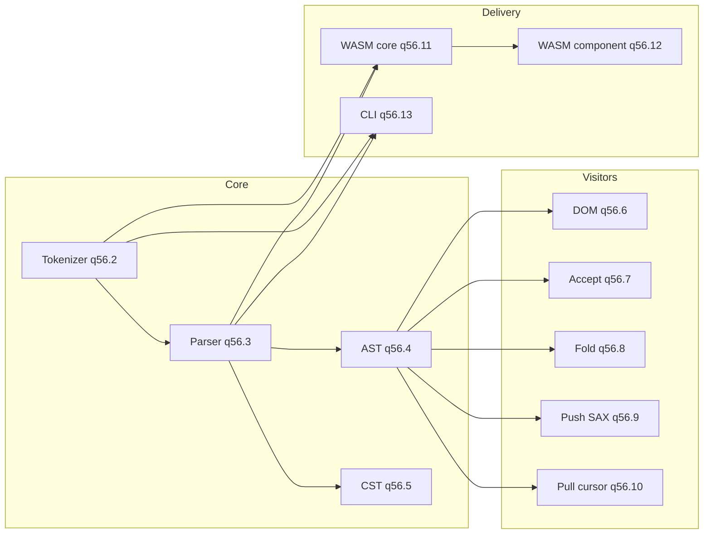

# Elm/Elmish Parser Initiative

Design and work breakdown for the moonrockz/krueger parser, tokenizer, AST, CST, visitors, WASM, and CLI.

**Beads epic:** `krueger-q56` — Elm/Elmish parser initiative: tokenizer, parser, AST, CST, visitors, WASM, CLI (see `.beads/issues.jsonl`)

## Scope

- **Tokenizer/lexer**: Produce token stream for Elm/Elmish source (bobzhang/lexer or custom). [krueger-q56.2]
- **Parser**: Grammar-driven parsing from tokens to AST/CST. [krueger-q56.3]
- **AST**: Algebraic types for modules, declarations, expressions (flexible like moonrockz/gherkin). [krueger-q56.4]
- **CST**: Concrete syntax tree with layout/source spans for tooling. [krueger-q56.5]
- **Visitors** (parity with gherkin): DOM [krueger-q56.6], accept-visitor [krueger-q56.7], fold [krueger-q56.8], push-based SAX [krueger-q56.9], pull-based cursor [krueger-q56.10]
- **WASM**: Core target [krueger-q56.11] + Component Model [krueger-q56.12] so tokenizer/parser are deliverable as components
- **CLI**: TheWaWaR/clap with `tokenize` and `lex` subcommands. [krueger-q56.13]

## Design phase

Before implementation, complete [krueger-q56.1] (Design phase: design doc, BDD scenarios (Gherkin), test strategy):

1. **Design doc**: This document; architecture, visitor model, WASM, CLI.
2. **BDD acceptance tests**: Gherkin `.feature` files for tokenizer, parser, AST/CST, visitors, CLI, WASM component.
3. **Test strategy**: Whitebox (`_wbtest.mbt`), blackbox (`_test.mbt`), e2e for CLI and WASM component; TDD for all stories.

## Architecture

## Visitor model (gherkin parity)

| Style | Issue | Description |
|-------|-------|-------------|
| **DOM** | krueger-q56.6 | Full tree; random access to parsed document |
| **Accept** | krueger-q56.7 | `doc.accept(visitor)`; depth-first; override only needed node types |
| **Fold** | krueger-q56.8 | `doc.fold(acc, callbacks)` with Continue/SkipChildren/Stop |
| **Push (SAX)** | krueger-q56.9 | Handler receives events as parser runs; no full AST required |
| **Pull (cursor)** | krueger-q56.10 | Iterator/reader yields events on demand (GherkinReader-style) |

## WASM strategy

- **Core WASM** [krueger-q56.11]: Library builds for MoonBit `wasm` target; tokenizer and parser callable from JS/wasm.
- **Component Model** [krueger-q56.12]: Tokenizer and parser exposed as WASM component(s) with WIT; e2e tests from host.

## CLI

- **Tool**: TheWaWaR/clap.
- **Subcommands**: `krueger tokenize`, `krueger lex` (and future `parse` when parser exists).
- **E2E**: Tests that run CLI and assert on stdout/exit code.

## Dependency order

1. Design [krueger-q56.1] (blocks all implementation)
2. Tokenizer [krueger-q56.2]
3. Parser [krueger-q56.3]
4. AST [krueger-q56.4], CST [krueger-q56.5] (parallel after parser)
5. Visitors [krueger-q56.6–q56.10] (after AST or parser as noted)
6. WASM core [krueger-q56.11], CLI [krueger-q56.13] (after tokenizer/parser)
7. WASM component [krueger-q56.12] (after WASM core)

## Test strategy (TDD)

- **Whitebox** (`*_wbtest.mbt`): Internal modules (scanner, parser, AST, visitor internals).
- **Blackbox** (`*_test.mbt`): Public API.
- **BDD**: Gherkin `.feature` files under `tests/` or `docs/` defining acceptance scenarios.
- **E2E**: CLI subcommands; WASM component from host (e.g. JS/Python).
- All implementation follows Red–Green–Refactor; tests written before code.
