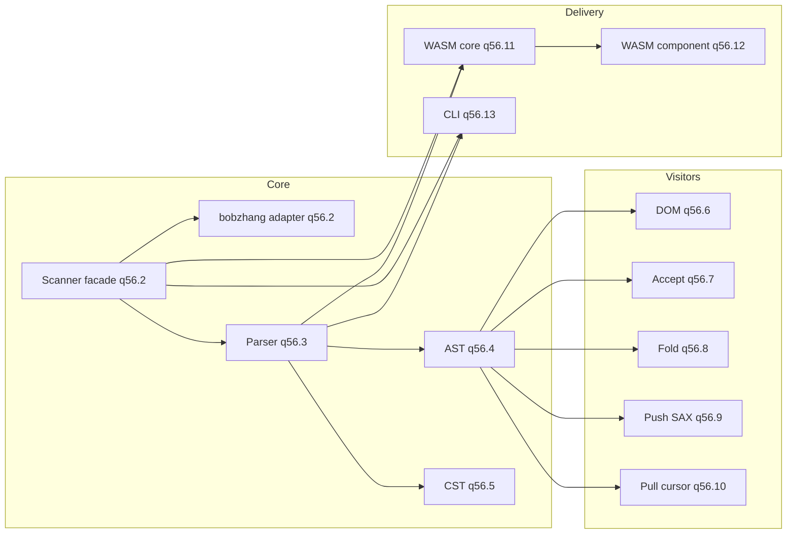

# Elm/Elmish Parser Initiative

Design and work breakdown for the `moonrockz/krueger` parser, tokenizer, AST,
CST, visitors, WASM, and CLI.

**Beads epic:** `krueger-q56` (see `.beads/issues.jsonl`)

## Scope

- **Tokenizer/lexer** [krueger-q56.2]: Produce token stream for Elm/Elmish
  source via a pluggable scanner abstraction. First adapter uses
  `bobzhang/lexer`.
- **Parser** [krueger-q56.3]: Grammar-driven parsing from tokens to AST/CST.
- **AST** [krueger-q56.4]: Algebraic types for modules, declarations, and
  expressions, with declaration metadata for doc comments.
- **CST** [krueger-q56.5]: Concrete syntax tree with full layout and comment
  preservation for tooling.
- **Visitors** [krueger-q56.6..q56.10]: DOM, accept-visitor, fold, push SAX,
  and pull cursor APIs.
- **WASM** [krueger-q56.11, q56.12]: Core wasm target and component-model
  packaging.
- **CLI** [krueger-q56.13]: TheWaWaR/clap commands `tokenize` and `lex`
  (future `parse`).

## Design phase deliverables (`krueger-q56.1`)

1. **Architecture and decisions** in this document.
2. **API contracts** in
   `docs/plans/api-contracts.md` (scanner/parser/ast/cst/visitor/diagnostics).
3. **Seed BDD artifacts** in `tests/features/` for tokenizer/parser, including
   comments and doc comments.
4. **Incremental test strategy** showing what each child issue must add.

## V1 language scope

The first implementation wave (starting at `krueger-q56.2`) targets an Elm core
subset:

1. Module declaration and exposing clause.
2. Import declarations.
3. Type aliases and simple union types.
4. Function declarations and type annotations.
5. Core expressions: literals, variable refs, calls, lambda, let-in,
   if-then-else, case-of (basic branches).
6. **Comments and doc comments**:
   - line comments, block comments, doc comments.
   - malformed comment forms produce diagnostics with spans.

## Architecture

## Contracts overview

The normative contract details live in `docs/plans/api-contracts.md`.
Implementation work must preserve these invariants:

1. **Scanner abstraction boundary**: parser depends on `Scanner` contract, not
   directly on a third-party lexer.
2. **AST/CST split**: AST is semantic; CST preserves source fidelity, including
   comments and trivia.
3. **Diagnostic model**: scanner and parser emit diagnostics with stable spans
   and machine-readable codes.
4. **Comment model**:
   - all comments are retained in trivia/CST.
   - doc comments are attached to the following declaration in AST metadata.

## Doc comment attachment rules (v1)

Doc comments bind to the next declaration only when:

1. The doc comment appears immediately before the declaration.
2. Only whitespace/newlines are between the doc comment and declaration.
3. No regular comment or non-trivia token appears in-between.

If these rules are not met, doc comments remain in CST/trivia and are not
attached in AST metadata.

## Visitor model (gherkin parity)

| Style | Issue | Description |
|-------|-------|-------------|
| **DOM** | krueger-q56.6 | Full tree; random access to parsed document |
| **Accept** | krueger-q56.7 | `doc.accept(visitor)` depth-first callbacks |
| **Fold** | krueger-q56.8 | `doc.fold(acc, callbacks)` with `Continue/SkipChildren/Stop` |
| **Push (SAX)** | krueger-q56.9 | Handler receives events while parsing |
| **Pull (cursor)** | krueger-q56.10 | Iterator/reader yields events on demand |

## WASM strategy

- **Core WASM** [krueger-q56.11]: Build scanner/parser contracts for MoonBit
  `wasm` target and expose tokenize/parse entrypoints.
- **Component Model** [krueger-q56.12]: Expose scanner/parser as component(s)
  with WIT contracts and host-driven e2e tests.

## CLI strategy

- **Tool**: TheWaWaR/clap.
- **Subcommands**: `krueger tokenize`, `krueger lex` (future `parse`).
- **Output contract**: stable token and diagnostic output, including comment and
  doc-comment representation.
- **E2E**: command behavior asserted via exit codes and stdout/stderr snapshots.

## Dependency order

1. Design [krueger-q56.1] (blocks all implementation)
2. Tokenizer [krueger-q56.2]
3. Parser [krueger-q56.3]
4. AST [krueger-q56.4], CST [krueger-q56.5] (parallel after parser)
5. Visitors [krueger-q56.6..q56.10]
6. WASM core [krueger-q56.11], CLI [krueger-q56.13]
7. WASM component [krueger-q56.12]

## Test strategy (TDD)

Tests are added incrementally per story. We do not create the complete test
corpus up front.

- **Whitebox** (`*_wbtest.mbt`): module-internal behavior.
- **Blackbox** (`*_test.mbt`): public API behavior.
- **BDD** (`tests/features/*.feature`): executable behavior specs.
- **E2E**: CLI and wasm/component host integration tests.
- **TDD**: red-green-refactor for each story.

### Story-to-test mapping

| Issue | Required test additions |
|-------|--------------------------|
| `krueger-q56.2` scanner | whitebox scanner internals, blackbox tokenize API, extend `tokenizer.feature` (including comment/doc-comment and malformed comment diagnostics) |
| `krueger-q56.3` parser | whitebox parser internals, blackbox parse API, extend `parser.feature` for success/error recovery and doc-comment attachment |
| `krueger-q56.4` AST | AST construction tests, metadata/doc-comment attachment behavior tests |
| `krueger-q56.5` CST | CST shape tests, full comment/trivia/source span preservation |
| `krueger-q56.6..q56.10` visitors | contract tests per visitor style, traversal ordering and stop/skip semantics |
| `krueger-q56.11` wasm core | wasm entrypoint tests from host harness |
| `krueger-q56.12` component model | e2e host/component integration tests |
| `krueger-q56.13` cli | CLI e2e tests for `tokenize`/`lex` output and exit behavior |

## Unblock criteria for `krueger-q56.2`

`krueger-q56.1` is complete when:

1. This document and `api-contracts.md` are both merged and mutually
   consistent.
2. Seed BDD files exist for tokenizer/parser including comments/doc-comments.
3. Scanner abstraction, diagnostic model, and doc-comment attachment rules are
   explicit and testable.
